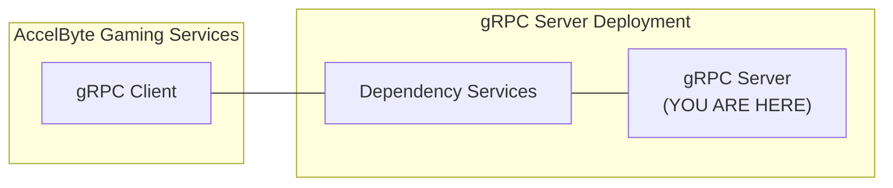

# cloudsave-validator-grpc-plugin-server-python



`AccelByte Gaming Services` capabilities can be extended using custom functions implemented in a `gRPC server`. If configured, custom functions in the `gRPC server` will be called by `AccelByte Gaming Services` instead of the default function.

The `gRPC server` and the `gRPC client` can actually communicate directly. However, additional services are necessary to provide **security**, **reliability**, **scalability**, and **observability**. We call these services as `dependency services`. The [grpc-plugin-dependencies](https://github.com/AccelByte/grpc-plugin-dependencies) repository is provided as an example of what these `dependency services` may look like. It
contains a docker compose which consists of these `dependency services`.

> :warning: **grpc-plugin-dependencies is provided as example for local development purpose only:** The dependency services in the actual gRPC server deployment may not be exactly the same.

## Overview

This repository contains a `sample custom cloudsave validator gRPC server app` written in `Python`. It provides a simple custom cloudsave record validation function for cloudsave service in `AccelByte Gaming Services`.

This sample app also shows how this `gRPC server` can be instrumented for better observability.
It is configured by default to send metrics, traces, and logs to the observability `dependency services` in [grpc-plugin-dependencies](https://github.com/AccelByte/grpc-plugin-dependencies).

## Prerequisites

Before starting, you will need the following.

1. Windows 10 WSL2 or Linux Ubuntu 20.04 with the following installed.

   a. bash

   b. make

   c. curl

   d. docker v23.x

   e. docker-compose v2.x

   f. docker loki driver

      ```
      docker plugin install grafana/loki-docker-driver:latest --alias loki --grant-all-permissions
      ```

   g. Python 3.9+

   h. git

   i. jq

   j. [ngrok](https://ngrok.com/)

   k. [postman](https://www.postman.com/)

2. A local copy of [grpc-plugin-dependencies](https://github.com/AccelByte/grpc-plugin-dependencies) repository.

   ```
   git clone https://github.com/AccelByte/grpc-plugin-dependencies.git
   ```

3. Access to `AccelByte Gaming Services` demo environment.

   a. Base URL: https://demo.accelbyte.io.

   b. [Create a Game Namespace](https://docs.accelbyte.io/esg/uam/namespaces.html#tutorials) if you don't have one yet. Keep the `Namespace ID`.

   c. [Create an OAuth Client](https://docs.accelbyte.io/guides/access/iam-client.html) with `confidential` client type. Keep the `Client ID` and `Client Secret`.

    - NAMESPACE:{namespace}:CLOUDSAVEGRPCSERVICE [READ]

## Setup

To be able to run this sample app, you will need to follow these setup steps.

1. Create a docker compose `.env` file by copying the content of [.env.template](.env.template) file.

   > :warning: **The host OS environment variables have higher precedence compared to `.env` file variables**: If the variables in `.env` file do not seem to take effect properly, check if there are host OS environment variables with the same name. 
   See documentation about [docker compose environment variables precedence](https://docs.docker.com/compose/environment-variables/envvars-precedence/) for more details.

2. Fill in the required environment variables in `.env` file as shown below.

   ```
   AB_BASE_URL=https://demo.accelbyte.io      # Base URL of AccelByte Gaming Services demo environment
   AB_CLIENT_ID='xxxxxxxxxx'                  # Use Client ID from the Prerequisites section
   AB_CLIENT_SECRET='xxxxxxxxxx'              # Use Client Secret from the Prerequisites section
   AB_NAMESPACE='xxxxxxxxxx'                  # Use Namespace ID from the Prerequisites section
   PLUGIN_GRPC_SERVER_AUTH_ENABLED=false      # Enable or disable access token and permission verification
   ```

   > :warning: **Keep PLUGIN_GRPC_SERVER_AUTH_ENABLED=false for now**: It is currently not
   supported by `AccelByte Gaming Services`, but it will be enabled later on to improve security. If it is
   enabled, the gRPC server will reject any calls from gRPC clients without proper authorization
   metadata.

## Building

To build this sample app, use the following command.

```
make build
```

## Running

To (build and) run this sample app in a container, use the following command.

```
docker-compose up --build
```

## Testing

### Functional Test in Local Development Environment

The custom functions in this sample app can be tested locally using `postman`.

1. Run the `dependency services` by following the `README.md` in the [grpc-plugin-dependencies](https://github.com/AccelByte/grpc-plugin-dependencies) repository.

   > :warning: **Make sure to start dependency services with mTLS disabled for now**: It is currently not supported by `AccelByte Gaming Services`, but it will be enabled later on to improve security. If it is enabled, the gRPC client calls without mTLS will be rejected.

2. Run this `gRPC server` sample app.

3. Open `postman`, create a new `gRPC request` (tutorial [here](https://blog.postman.com/postman-now-supports-grpc/)), and enter `localhost:10000` as server URL. 

   > :exclamation: We are essentially accessing the `gRPC server` through an `Envoy` proxy in `dependency services`.

4. Still in `postman`, continue by selecting `CloudsaveValidatorService/BeforeWritePlayerRecord` method and invoke it with the sample message below.

   a. With a VALID `payload`

      ```json
      {
          "createdAt": "2023-10-26T00:00:00.000Z",
          "isPublic": true,
          "key": "favourite_weapon",
          "namespace": "mynamespace",
          "payload": "eyJ1c2VySWQiOiAiMWUwNzZiY2VlNmQxNGM4NDlmZmIxMjFjMGUwMTM1YmUiLCAiZmF2b3VyaXRlV2VhcG9uVHlwZSI6ICJTV09SRCIsICJmYXZvdXJpdGVXZWFwb24iOiAiZXhjYWxpYnVyIn0=",  // {"userId": "1e076bcee6d14c849ffb121c0e0135be", "favouriteWeaponType": "SWORD", "favouriteWeapon": "excalibur"} encoded in base64
          "setBy": "SERVER",
          "updatedAt": "2023-10-26T00:00:00.000Z",
          "userId": "1e076bcee6d14c849ffb121c0e0135be"
      }
      ```
   
      With the payload being the base64 string representation of this json object:

      ```json
      {
          "userId": "1e076bcee6d14c849ffb121c0e0135be",
          "favouriteWeaponType": "SWORD",
          "favouriteWeapon": "excalibur"
      }
      ```

      The response will contain `isSuccess: true`

      ```json
      {
          "isSuccess": true,
          "key": "favourite_weapon",
          "userId": "1e076bcee6d14c849ffb121c0e0135be"
      }
      ```

   b. With an INVALID `payload`
   
      ```json
      {
          "createdAt": "2023-10-26T00:00:00.000Z",
          "isPublic": true,
          "key": "favourite_weapon",
          "namespace": "mynamespace",
          "payload": "eyJmb28iOiJiYXIifQ==",
          "setBy": "SERVER",
          "updatedAt": "2023-10-26T00:00:00.000Z",
          "userId": "1e076bcee6d14c849ffb121c0e0135be"
      }
      ```
   
      With the payload being the base64 string representation of this json object:

      ```json
      {
          "foo": "bar"
      }
      ```

      The response will contain `isSuccess: false`

      ```json
      {
          "isSuccess": false,
          "key": "favourite_weapon",
          "userId": "1e076bcee6d14c849ffb121c0e0135be",
          "error": {
              "errorCode": 1,
              "errorMessage": "favourite weapon cannot be empty;favourite weapon type cannot be empty;user ID cannot be empty"
          }
      }
      ```

### Integration Test with AccelByte Gaming Services

After passing functional test in local development environment, you may want to perform
integration test with `AccelByte Gaming Services`. Here, we are going to expose the `gRPC server`
in local development environment to the internet so that it can be called by
`AccelByte Gaming Services`. To do this without requiring public IP, we can use [ngrok](https://ngrok.com/)

1. Run the `dependency services` by following the `README.md` in the [grpc-plugin-dependencies](https://github.com/AccelByte/grpc-plugin-dependencies) repository.

   > :warning: **Make sure to start dependency services with mTLS disabled for now**: It is currently not supported by `AccelByte Gaming Services`, but it will be enabled later on to improve security. If it is enabled, the gRPC client calls without mTLS will be rejected.

2. Run this `gRPC server` sample app.

3. Sign-in/sign-up to [ngrok](https://ngrok.com/) and get your auth token in `ngrok` dashboard.

4. In [grpc-plugin-dependencies](https://github.com/AccelByte/grpc-plugin-dependencies) repository folder, run the following command to expose the `Envoy` proxy port connected to the `gRPC server` in local development environment to the internet. Take a note of the `ngrok` forwarding URL e.g. `tcp://0.tcp.ap.ngrok.io:xxxxx`.

   ```
   make ngrok NGROK_AUTHTOKEN=xxxxxxxxxxx    # Use your ngrok auth token
   ```

5. [Create an OAuth Client](https://docs.accelbyte.io/guides/access/iam-client.html) with `confidential` client type with the following permissions. Keep the `Client ID` and `Client Secret`.

   - ADMIN:NAMESPACE:{namespace}:CLOUDSAVE:PLUGINS [CREATE, READ, UPDATE, DELETE]
   - ADMIN:NAMESPACE:{namespace}:USER:*:CLOUDSAVE:RECORD [CREATE, READ, UPDATE, DELETE]
   - ADMIN:NAMESPACE:{namespace}:CLOUDSAVE:RECORD [CREATE, READ, UPDATE, DELETE]
   - NAMESPACE:{namespace}:CLOUDSAVE:RECORD [CREATE, READ, UPDATE, DELETE]
   - ADMIN:NAMESPACE:{namespace}:INFORMATION:USER:* [DELETE]

   > :warning: **Oauth Client created in this step is different from the one from Prerequisites section:** It is required by [demo.sh](demo.sh) script in the next step to register the `gRPC Server` URL and also to create and delete test users.

6. Run the [demo.sh](demo.sh) script to simulate cloudsave operation which calls this sample `gRPC server` using the `Client ID` and `Client Secret` created in the previous step. Pay attention to sample `gRPC server` console log when the script is running. `gRPC Server` methods should get called.

   ```
   export AB_BASE_URL='https://demo.accelbyte.io'
   export AB_CLIENT_ID='xxxxxxxxxx'         # Use Client ID from the previous step
   export AB_CLIENT_SECRET='xxxxxxxxxx'     # Use Client Secret from the previous step    
   export AB_NAMESPACE='accelbyte'          # Use your Namespace ID
   export GRPC_SERVER_URL='0.tcp.ap.ngrok.io:xxxxx'  # Use your ngrok forwarding URL
   bash demo.sh
   ```

   > :warning: **Make sure demo.sh has Unix line-endings (LF)**: If this repository was cloned in Windows for example, the `demo.sh` may have Windows line-endings (CRLF) instead. In this case, use tools like `dos2unix` to change the line-endings to Unix (LF).
   Invalid line-endings may cause errors such as `demo.sh: line 2: $'\r': command not found`.

> :warning: **Ngrok free plan has some limitations**: You may want to use paid plan if the traffic is high.

### Deploy to AccelByte Gaming Services

After passing integration test against locally running sample app you may want to deploy the sample app to AGS (AccelByte Gaming Services).

1. Download and setup [extend-helper-cli](https://github.com/AccelByte/extend-helper-cli/)
2. Create new Extend App on Admin Portal, please refer to docs [here](https://docs-preview.accelbyte.io/gaming-services/services/customization/using-custom-matchmaking/)
3. Do docker login using `extend-helper-cli`, please refer to its documentation
4. Build and push sample app docker image to AccelByte ECR using the following command inside sample app directory
   ```
   make imagex_push REPO_URL=xxxxxxxxxx.dkr.ecr.us-west-2.amazonaws.com/accelbyte/justice/development/extend/xxxxxxxxxx/xxxxxxxxxx IMAGE_TAG=v0.0.1
   ```
   > Note: the REPO_URL is obtained from step 2 in the app detail on the 'Repository Url' field
